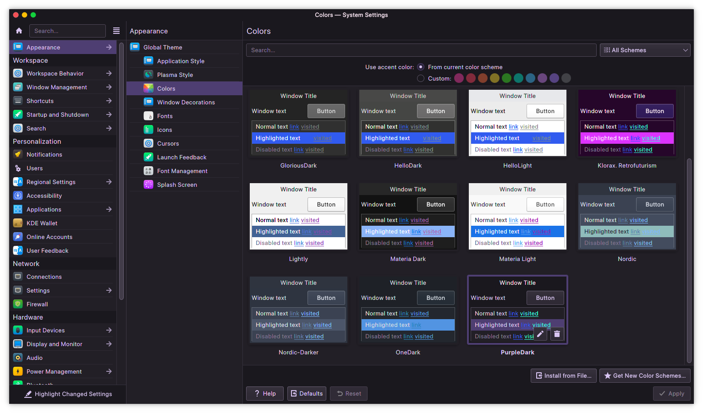

<h2> 🔮 Purple Dark Plasma Colors 🔮 </h2>

A Plasma color theme inspired by the colors from the [ZorinOS purple dark theme](https://github.com/ZorinOS/zorin-desktop-themes/tree/master/ZorinPurple-Dark)!

Icons used: [Suru+-Dark](https://github.com/gusbemacbe/suru-plus-dark)

Window Decorations used: [Sierra Breeze](https://github.com/kay0u/SierraBreeze)

# 📥 Installation

`mkdir -p ~/.local/share/color-schemes && cp PurpleDark.colors ~/.local/share/color-schemes`

# 🧩 Recommended complementary projects

- Discord theme: [Purple Dark Glass](https://github.com/D3SOX/Purple-Dark-Glass)
- VSCode theme: [SynthWave '84](https://github.com/robb0wen/synthwave-vscode)
- GTK theme: [ZorinOS purple dark theme](https://github.com/ZorinOS/zorin-desktop-themes/tree/master/ZorinPurple-Dark)
- Spotify theme: [Ziro](https://github.com/schnensch0/ziro/tree/main/preview#purple-dark)
